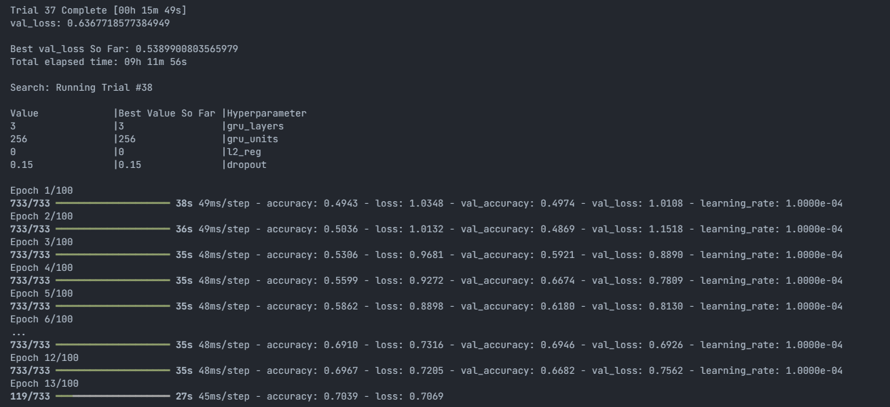

# Hitnet

基本上沒有太大的改動，把資料夾路徑改掉跑一次 notebook 應該就可以開始訓練了，新的 data 我放在 package（約 34.1 GB）。

- 每個 match 新增 `hits/`，包含每個 rally 的 `hit.csv`。
- 更新每個 rally 的 pose。

如果不想下載整個 data，也附上了生成資料的 codes，改一下資料夾路徑就可以用了。

- `hit_csv.py`: 生成 `hit.csv`。
- `generate_pose.py`: 生成新的 pose。
    - 確保它能抓到新的 `detect_pose.py`，只有改這邊而已
        ```py
        if len(players_inside_court) < 2:
                out_video.write(frame)
                bottom_player_data.append({'frame': frame_idx, 'keypoints': [(0, 0) for _ in range(17)]})
                top_player_data.append({'frame': frame_idx, 'keypoints': [(0, 0) for _ in range(17)]})
                continue
        ```
---
## Training

實驗建議
* 開啟 GPU 加速
* 如果 RAM 空間夠可以試試看 `BATCH_SIZE = 1024` 或更高。
    * 現在是 `BATCH_SIZE = 1024`，GPU RAM 使用率 13.5/16 GB。
* 訓練是使用 `keras_tuner` 和 `trial = 50`，有點像 `optuna`，可以試試看減少 `trial` 的數量。
* `learning_rate = 1e-4` 感覺最合適，但 `val_acc` 目前容易卡在 75%。
* `epoch = 100`我覺得差不多，因為 early stopping 的機會不小。
* 其他 hyperparameter
    ```py
    for layer in range(hp.Choice('gru_layers', [1, 2, 3])):
            x = Bidirectional(GRU(
                hp.Choice('gru_units', [64, 128, 256]),
                return_sequences=True,
                kernel_regularizer=tf.keras.regularizers.l2(hp.Choice('l2_reg', [0., 1e-6, 1e-4, 1e-2])),
                dropout=hp.Choice('dropout', [0.15, 0.3, 0.45])
            ))(x)
        x = GlobalMaxPool1D()(x)
        x = Dense(
            3
        )(x)
    ```
目前我這邊測下來一個 epoch 約 35 秒。


---
## Tensorflow GPU Issue

訓練是使用 **Tensorflow**，但很麻煩的是從 `Tensorflow 2.11` 開始不再支援 Native Windows 的 GPU 加速，現在如果 Python 版本大於 `3.9.x` 的話 `pip install tensorflow` 的最低版本是 `2.12.0`，沒辦法指定支援 GPU 的版本。不知道你有沒有需要，總之下面提供幾個解法：

1. 不使用 GPU 加速。

    - `BATCH_SIZE = 1024` 一個 epoch 約 3 分鐘。

2. 用 virtual environment 裝 `Python3.8` 然後 `pip install tensorflow==2.10.1`

    - 可以參考[這篇](https://hackmd.io/@jerrychu/S1QvFG98h)

3. 用 WSL 創建 Linux environment 然後 `pip install tensorflow[and-cuda]`，沒有其他限制。

    - 可以參考[這篇](https://sakkyoi.tech/article/install-tensorflow-cuda-on-windows/)